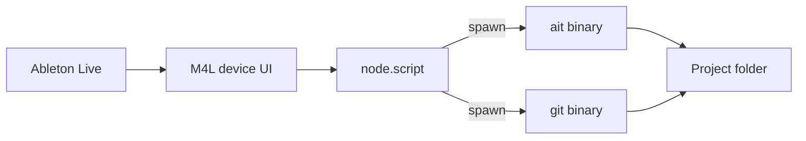

# Ableton Live UI for ait (Max for Live)

Add a **Max for Live** device that exposes **`ait`** and **git** workflows inside Ableton Live via `node.script` subprocesses to the existing **`ait`** and **`git`** binaries. **CLI remains the source of truth** for behavior; the UI is a thin control surface. This **revises** the prior design non-goal **“no plugin bundling”** (see ADR-002 + PRD/design updates in **ALC-229**).

**Linear:** Epic **[ALC-228](https://linear.app/alcyon/issue/ALC-228/epic-ableton-live-ui-for-ait-max-for-live)** · children **ALC-229–ALC-233**

---

## Acceptance Criteria

- [ ] PRD + design doc allow M4L UI; ADR-002 documents architecture and trade-offs (**ALC-229**)
- [ ] CLI exposes **documented, parseable** output for UI-needed commands (additive `--json` or equivalent) (**ALC-230**)
- [ ] M4L device loads in Live; configurable **absolute paths** to `ait` + `git`; async subprocess helper (**ALC-231**)
- [ ] Git panel: branch, status, checkout, commit with clear errors (**ALC-232**)
- [ ] ait panel: `init`, `doctor` (+ `--json` view), `hooks` install/uninstall, `version` (**ALC-233**)
- [ ] Docs: install, PATH/Gatekeeper, “reopen `.als` after branch switch” warning
- [ ] `go test ./...` stays green; M4L smoke steps documented for manual QA

---

## Architecture



---

## Implementation Steps

### Step 1: Product + ADR baseline (ALC-229)

- Files: `docs/PRD.md`, `docs/design/ait-design.md`, `docs/adr/ADR-002-max-for-live-ui.md`
- Details: Replace/adjust **NG: no plugin bundling** with scoped M4L exception (macOS); document subprocess trust model, PATH, signing risks; add integration diagram.

### Step 2: CLI machine output (ALC-230)

- Files: `docs/spec/cli-contract.md`, `cmd/ait/*.go`, `internal/**/*_test.go`
- Details: Inventory M4L-required commands; add **`--json`** (or stable stdout) for any that are human-only today; extend tests; keep backward-compatible defaults.

### Step 3: M4L foundation (ALC-231)

- Files: `m4l/**` (new), `README.md`, optional `docs/user/m4l-ait-control.md`
- Details: Project skeleton, `package.json`, `node.script`, settings storage for `AIT_BIN` / `GIT_BIN`, smoke UI showing `ait version` output.

### Step 4: Git panel (ALC-232)

- Files: `m4l/**`
- Details: Resolve **project root** (Live set directory) and pass `git -C <root> …`; branch list/checkout; status; commit (document staging policy).

### Step 5: ait command panel (ALC-233)

- Files: `m4l/**`, cross-links in `docs/spec/cli-contract.md`
- Details: Wire `init` / `doctor` / `hooks` / `version`; render `doctor --json`; surface exit codes.

---

## Dependencies

- **External:** Ableton Live + Max for Live, macOS, user-installed `git`, user-installed `ait`
- **Internal:** Existing CLI (`doctor --json` already); **ALC-229** before **ALC-230**/**ALC-231**; **ALC-230**+**ALC-231** before **ALC-233**

---

## Testing Strategy

- **Unit:** Go tests for new JSON/output flags (**ALC-230**)
- **Integration:** None required in CI for M4L; document manual smoke checklist
- **Manual:** Load device in Live; run each command against a test Live project folder; verify branch switch + reopen `.als` behavior

---

## Execution Graph

```yaml
waves:
  - name: "Wave 1 — Product baseline"
    parallel: false
    issues:
      - id: ALC-229
        branch_from: main

  - name: "Wave 2 — CLI + M4L scaffold"
    parallel: true
    issues:
      - id: ALC-230
        branch_from: main
      - id: ALC-231
        branch_from: main

  - name: "Wave 3 — UI panels"
    parallel: true
    issues:
      - id: ALC-232
        branch_from: main
      - id: ALC-233
        branch_from: main

merge_order:
  - ALC-229
  - ALC-230
  - ALC-231
  - ALC-232
  - ALC-233
```

**Note:** **ALC-232** / **ALC-233** should merge only after **ALC-230** and **ALC-231** are on `main` (or use stacked branches if implementing before merge — prefer rebasing feature branches onto updated `main` between waves).
