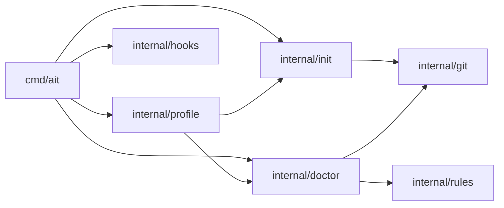

# ait CLI MVP (Ableton-first, macOS)

Ship the v0.1 **ait** command-line tool per [docs/design/ait-design.md](../docs/design/ait-design.md): profile-driven **`init`**, **`doctor`** with core rules, **`hooks install`**, embedded **Ableton** profile + **presets**, user **playbook** docs, and **macOS CI**. No hosted service; Git + Git LFS via subprocess only.

---

## Acceptance Criteria

- [ ] `ait version` prints binary version and embedded **profile bundle** hash or version string.
- [ ] `ait init --daw ableton --preset samples-ignored` (default preset when omitted matches design: **samples-ignored**) **merges** `.gitignore` / `.gitattributes` without clobbering existing unique lines; **`--dry-run`** prints planned changes; **`--force`** documented for overwrite policy.
- [ ] `ait init` runs **`git init`** when not inside a repo; runs **`git lfs install`** when preset **`samples-lfs`** requires LFS patterns.
- [ ] `ait doctor` runs **git** and **git-lfs** presence/version checks and emits **actionable** findings for: tracked **`Backup/`** (or `Backup/*.als` per profile), **large tracked audio** when preset expects LFS, **`.gitattributes` vs working tree** LFS mismatch (basic), **Ableton layout** heuristic (`.als` present; optional **`Samples/Collected`** empty warning).
- [ ] `ait doctor` supports **`--fail-on error`** (default) and **`--fail-on warn`**; exit code **non-zero** when failing severity met.
- [ ] `ait doctor --json` emits stable **`schema_version`** + findings array suitable for CI (stretch if not P0: ship in same milestone as doctor rules).
- [ ] `ait hooks install` writes **`.git/hooks/pre-commit`** that invokes **`ait doctor --hook --fail-on error`**; **`--uninstall`** removes ait-managed hook safely (marker comment).
- [ ] **`.ait/lock.json`** validated by `doctor`; **overlapping active locks** → **warn**; **expired** lock → **info** to remove.
- [ ] **`docs/user/`** (or `docs/playbook/`) includes **collaboration playbook** (single-writer `.als`, branching, handoff) with links to Ableton Help from PRD.
- [ ] **GitHub Actions** workflow on **macOS** runs **`go test ./...`** on push/PR; documents optional **git-lfs** in CI for integration tests.

---

## Architecture



---

## Implementation Steps

### Step 1: Go module scaffold and CLI root (AIT-01)

- Files: `go.mod`, `go.sum`, `cmd/ait/main.go`, `Makefile` or `taskfile` (optional), `.github/workflows/ci.yml` (minimal `go test` only placeholder OK), `README.md` (update with build instructions)
- Details: Initialize **Go 1.22+** module `github.com/<org>/ait` or `ait` path TBD; add **cobra** root command; implement **`ait version`** with **ldflags** for version string; create package dirs `internal/profile`, `internal/git`, `internal/init`, `internal/doctor`, `internal/rules`, `internal/hooks` as empty packages or stubs. Enforce **macOS** build tag only in docs for v1 (no `//go:build darwin` lock yet unless desired).

### Step 2: Embedded profiles and preset merge ([ALC-221](https://linear.app/alcyon/issue/ALC-221))

- Files: `internal/profile/profile.go`, `internal/profile/merge.go`, `profiles/ableton@12.yaml`, `presets/minimal.yaml`, `presets/samples-ignored.yaml`, `presets/samples-lfs.yaml`, `internal/profile/*_test.go`, `embed` directive
- Details: Define YAML schema matching design: **ignore blocks**, **gitattributes lines**, **doctor rule IDs** + params, **markers** for Ableton project detection. Implement **preset overlay** on profile. Unit tests: merge order, unknown preset error, embedded FS load. Populate **Ableton** ignores: `Backup/`, optional `*.asd`, common render/scratch paths per PRD appendix.

### Step 3: Git subprocess adapter ([ALC-222](https://linear.app/alcyon/issue/ALC-222))

- Files: `internal/git/git.go`, `internal/git/git_test.go`
- Details: Wrappers for `git version`, `git rev-parse --is-inside-work-tree`, `git init`, `git lfs version`, `git lfs install`, `git ls-files`, `git check-ignore`, with **timeouts** (e.g. 5s) per design. Tests: table-driven with **mocked command** or skip integration when `git` missing.

### Step 4: `ait init` command ([ALC-223](https://linear.app/alcyon/issue/ALC-223))

- Files: `internal/init/init.go`, `internal/init/merge_ignore.go`, `internal/init/merge_attributes.go`, `cmd/ait/init.go`, `internal/init/*_test.go`
- Details: Implement **idempotent** merge for `.gitignore` and `.gitattributes` (append **ait section** with markers `# BEGIN ait` / `# END ait` for safe re-run). Wire **`--dry-run`**, **`--force`** policy (overwrite section only). Call **`git init`** when not a repo; call **`git lfs install`** when preset includes LFS patterns. Integration test in tempdir with real `git`.

### Step 5: Doctor engine and human output ([ALC-224](https://linear.app/alcyon/issue/ALC-224))

- Files: `internal/doctor/doctor.go`, `internal/doctor/finding.go`, `internal/doctor/render.go`, `cmd/ait/doctor.go`, `internal/doctor/*_test.go`
- Details: **Finding** model: `code`, `severity`, `message`, `path`, `hint`, `doc_anchor`. **Runner** executes registered rules; **human** output grouped by severity; **`--verbose`** prints rule id + duration. Exit code **1** on any error by default; **`--hook`** reduces noise (one line per error or summary). Respect **profile + preset** from `.ait/config.yaml` if present else flags (`--daw`, `--preset`) for doctor context.

### Step 6: Doctor rules suite ([ALC-225](https://linear.app/alcyon/issue/ALC-225))

- Files: `internal/rules/gitversion.go`, `internal/rules/lfs.go`, `internal/rules/backup_tracked.go`, `internal/rules/ableton_layout.go`, `internal/rules/size_lfs.go`, `internal/rules/lockfile.go`, `internal/rules/fixtures/*`, `internal/rules/*_test.go`
- Details: Implement rules per design: **git/lfs** binaries; **Backup/** in index; **large files** vs `.gitattributes` LFS patterns (heuristic); **layout** (`.als` count, `Samples/Collected` warning); **`.ait/lock.json`** parse (JSON schema) + overlap detection. Use **fixture repos** in tests (golden). Per-rule **timeout** in runner.

### Step 7: `ait hooks install` / uninstall ([ALC-226](https://linear.app/alcyon/issue/ALC-226))

- Files: `internal/hooks/install.go`, `cmd/ait/hooks.go`, `internal/hooks/*_test.go`
- Details: Write **pre-commit** to `.git/hooks/pre-commit` with shebang; resolve **`ait` binary path** via `os.Executable()` or `PATH` (document caveat for global install). Embed **marker** `# ait-managed` for uninstall. Tests with temp git dir.

### Step 8: JSON output, CI hardening, user playbook ([ALC-227](https://linear.app/alcyon/issue/ALC-227))

- Files: `internal/doctor/json.go`, `docs/user/collaboration-playbook.md`, `.github/workflows/ci.yml` (full), `README.md`
- Details: **`--json`**: include `schema_version: 1` and findings array. Align exit codes with **`--fail-on`**. Expand CI: macOS runner, `go test ./...`, cache modules. Add **playbook** markdown: single-writer, branch strategy, handoff template, Collect All + factory packs links. README: install from source + future Homebrew note.

---

## Dependencies

- **External:** Go 1.22+, **cobra**, **git**, **git-lfs** (runtime); YAML lib (**gopkg.in/yaml.v3** or **sigs.k8s.io/yaml**); test **testify** optional.
- **Internal:** Strict order **ALC-220 → (ALC-221 ∥ ALC-222) → ALC-223 → ALC-224 → ALC-225 → ALC-226 → ALC-227** (see Execution Graph).

---

## Testing Strategy

- **Unit:** Profile merge; ignore/attributes section merge; each doctor rule with fixtures; lock JSON validation; hook script generation.
- **Integration:** Temp repos with real `git` (and optional `git-lfs` in CI job) for `init` and `doctor` end-to-end.
- **Manual:** Run CLI against a real **Ableton Live** project folder (user dogfood); verify `doctor` messages match expectations.

---

## Execution Graph

**Linear project:** [ait](https://linear.app/alcyon/project/ait-b7a84c915957) (Alcyon team) — epic + all issues below are on this project.

**Linear epic:** [ALC-219](https://linear.app/alcyon/issue/ALC-219/epic-ait-cli-mvp-ableton-first-macos)

```yaml
waves:
  - name: "Wave 1 — Scaffold"
    parallel: false
    issues:
      - id: ALC-220
        branch_from: main

  - name: "Wave 2 — Profile + Git adapter"
    parallel: true
    issues:
      - id: ALC-221
        branch_from: ALC-220
      - id: ALC-222
        branch_from: ALC-220

  - name: "Wave 3 — Init command"
    parallel: false
    issues:
      - id: ALC-223
        branch_from: ALC-222

  - name: "Wave 4 — Doctor engine"
    parallel: false
    issues:
      - id: ALC-224
        branch_from: ALC-223

  - name: "Wave 5 — Doctor rules"
    parallel: false
    issues:
      - id: ALC-225
        branch_from: ALC-224

  - name: "Wave 6 — Hooks"
    parallel: false
    issues:
      - id: ALC-226
        branch_from: ALC-225

  - name: "Wave 7 — JSON + CI + docs"
    parallel: false
    issues:
      - id: ALC-227
        branch_from: ALC-226

merge_order:
  - ALC-220
  - ALC-221
  - ALC-222
  - ALC-223
  - ALC-224
  - ALC-225
  - ALC-226
  - ALC-227
```

| Placeholder | Linear |
|-------------|--------|
| AIT-01 | [ALC-220](https://linear.app/alcyon/issue/ALC-220) |
| AIT-02 | [ALC-221](https://linear.app/alcyon/issue/ALC-221) |
| AIT-03 | [ALC-222](https://linear.app/alcyon/issue/ALC-222) |
| AIT-04 | [ALC-223](https://linear.app/alcyon/issue/ALC-223) |
| AIT-05 | [ALC-224](https://linear.app/alcyon/issue/ALC-224) |
| AIT-06 | [ALC-225](https://linear.app/alcyon/issue/ALC-225) |
| AIT-07 | [ALC-226](https://linear.app/alcyon/issue/ALC-226) |
| AIT-08 | [ALC-227](https://linear.app/alcyon/issue/ALC-227) |

**Note:** ALC-223 depends on **both** ALC-221 and ALC-222 (Linear **blockedBy** set). `branch_from: ALC-222` is for stacked-branch tools; merge **both** parents to `main` before cutting ALC-223 if you do not stack.

---

## Estimated Scope

| Issue | Approx. effort |
|-------|----------------|
| ALC-220 | 1–2 h |
| ALC-221 | 3–4 h |
| ALC-222 | 2–3 h |
| ALC-223 | 3–4 h |
| ALC-224 | 3–4 h |
| ALC-225 | 4–6 h |
| ALC-226 | 2–3 h |
| ALC-227 | 2–4 h |

---

## Risks (from design)

- **False positives** on Ableton layout across Live versions → profile versioning + tuning tests.
- **Hook path** resolution when `ait` not on PATH → document `brew install` / full path pattern.
