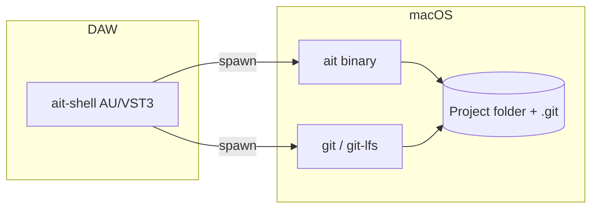

# VST3 / AU plugin shell (clean master-track UI)

Add an optional **native plugin** (AU + VST3 on macOS via **JUCE**) that wraps the same **`ait` + `git` subprocess** model as M4L, with a **clean, producer-facing UI** suitable for **master-track** insertion in Ableton Live and other hosts. **CLI + [`docs/spec/cli-contract.md`](../docs/spec/cli-contract.md) remain canonical.**

**Linear:** Epic **[ALC-234](https://linear.app/alcyon/issue/ALC-234/epic-ait-vstau-plugin-shell-clean-master-track-ui)** · children **ALC-235–ALC-239**

---

## Research brief (confirmed assumptions)

| Topic | Assumption |
|-------|------------|
| **Stack** | **JUCE** + **CMake**; AU + VST3 targets on **macOS** first |
| **Audio** | **Transparent passthrough** (or equivalent no-op) — safe on master, no creative processing |
| **Integration** | **Subprocess** to user-installed **`ait`** and **`git`** (absolute paths in settings); parse **ALC-230** JSON modes |
| **vs M4L** | Complementary; users who dislike Max presentation get **native plugin chrome** |
| **Distribution v1** | Document **codesign + notarization**; do **not** bundle `ait` inside the plugin binary |

---

## Acceptance Criteria

- [ ] **ADR-003** documents decision, consequences, and relation to ADR-002 (**ALC-235**)
- [ ] **PRD / design / cli-contract** reference optional native shell without violating NG4 (**ALC-235**)
- [ ] **JUCE project** builds AU + VST3 artifacts on developer Mac; loads in Live (**ALC-236**)
- [ ] **Default UI** is readable at small width; **Advanced** + **Settings** hide complexity (**ALC-237**)
- [ ] **Subprocess bridge** drives UI from real `ait`/`git` output; errors visible to user (**ALC-238**)
- [ ] **CI and/or documented manual release** + **user install guide** (**ALC-239**)

---

## Architecture



---

## Implementation Steps

### Step 1: ADR-003 + product docs (ALC-235)

- Files: `docs/adr/ADR-003-vst-au-plugin-shell.md`, `docs/PRD.md`, `docs/design/ait-design.md`, `docs/spec/cli-contract.md`, `docs/features/vst-plugin-shell.md`, `.cursor/plans/vst-plugin-shell.plan.md`
- Details: Mark ADR **Proposed** → **Accepted** when reviewed; add PRD goal/FR stub for optional native shell; design diagram + alignment table row; cli-contract §6b pointer to plugin doc.

### Step 2: JUCE scaffold (ALC-236)

- Files: `plugins/ait-shell/**` (CMakeLists, JUCE plugin project), `plugins/README.md`, root `README.md` link
- Details: Plugin IDs; stereo passthrough processor; blank editor; local build instructions; JUCE via submodule or FetchContent per ADR.

### Step 3: Plugin UI shell (ALC-237)

- Files: `plugins/ait-shell/Source/**` (editor components, layout)
- Details: Primary: status/health + quick actions; toggle **Advanced** for Git strip; **Settings** for paths and project root; copy for master-track (“reopen session after branch switch”).

### Step 4: Subprocess bridge (ALC-238)

- Files: `plugins/ait-shell/Source/**` (runner, parsers, settings persistence)
- Details: Async spawn; thread → message thread marshaling; JSON parse for doctor/version/init/hooks; `git -C` status/branch/checkout/commit policy documented to match M4L staging choice.

### Step 5: CI, signing, user guide (ALC-239)

- Files: `.github/workflows/*`, `docs/user/vst-ait-shell.md`, `plugins/ait-shell/README.md`
- Details: macOS workflow optional first run; developer checklist for sign/notarize/staple; end-user install paths for `.component` / `.vst3`.

---

## Dependencies

- **External:** Xcode, JUCE, Apple Developer account for **distribution** builds; Ableton Live for smoke load
- **Internal:** **ALC-230** machine JSON on `main`; **M4L** behavior as reference for semantics (**`m4l/ait-control/`**)

---

## Testing Strategy

- **Unit:** JSON parsing helpers (C++) where practical; keep thin—prefer golden samples from `cli-contract`
- **Integration:** Manual: load plugin in Live on master, run doctor/version, verify Git strip
- **CI:** Build plugin on `macos-latest` when workflow lands (**ALC-239**); Go `go test ./...` unchanged

---

## Estimated Scope

| Step | Issue | Estimate |
|------|-------|----------|
| Docs + ADR | ALC-235 | 2–3 h |
| JUCE scaffold | ALC-236 | 4–6 h |
| UI shell | ALC-237 | 4–6 h |
| Subprocess bridge | ALC-238 | 5–8 h |
| CI + signing + user doc | ALC-239 | 3–4 h |

---

## Execution Graph

```yaml
waves:
  - name: "Wave 1 — Architecture + docs"
    parallel: false
    issues:
      - id: ALC-235
        branch_from: main

  - name: "Wave 2 — Native scaffold"
    parallel: false
    issues:
      - id: ALC-236
        branch_from: main

  - name: "Wave 3 — UI + bridge"
    parallel: true
    issues:
      - id: ALC-237
        branch_from: main
      - id: ALC-238
        branch_from: main

  - name: "Wave 4 — Release hygiene"
    parallel: false
    issues:
      - id: ALC-239
        branch_from: main

merge_order:
  - ALC-235
  - ALC-236
  - ALC-237
  - ALC-238
  - ALC-239
```

**Note:** **ALC-237** and **ALC-238** will touch the same tree; expect **merge conflicts** if done in parallel without coordination—prefer **stacked branches** or **serialize** if two agents both edit `plugins/ait-shell/Source/`. `orchestrate-epic` may stack **ALC-238** on **ALC-237**’s branch if needed.
