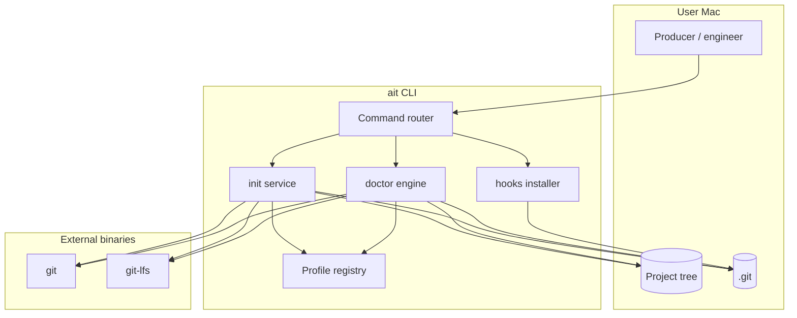
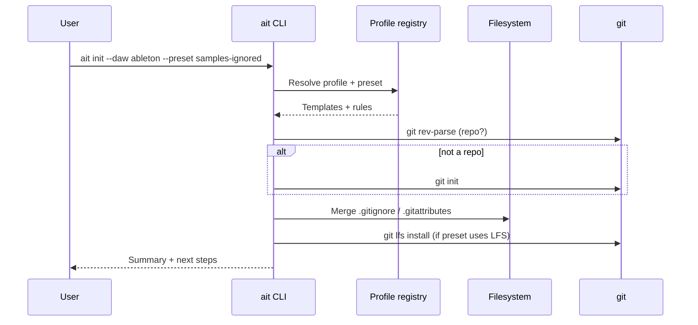
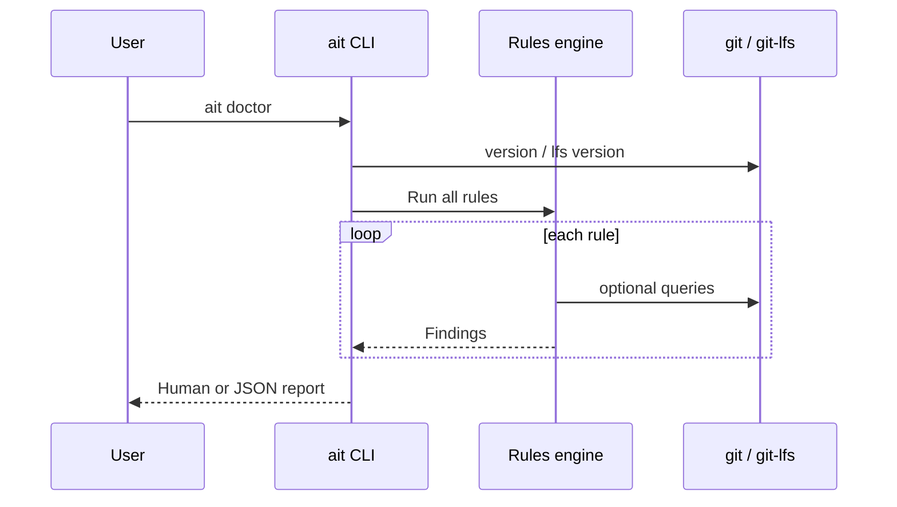
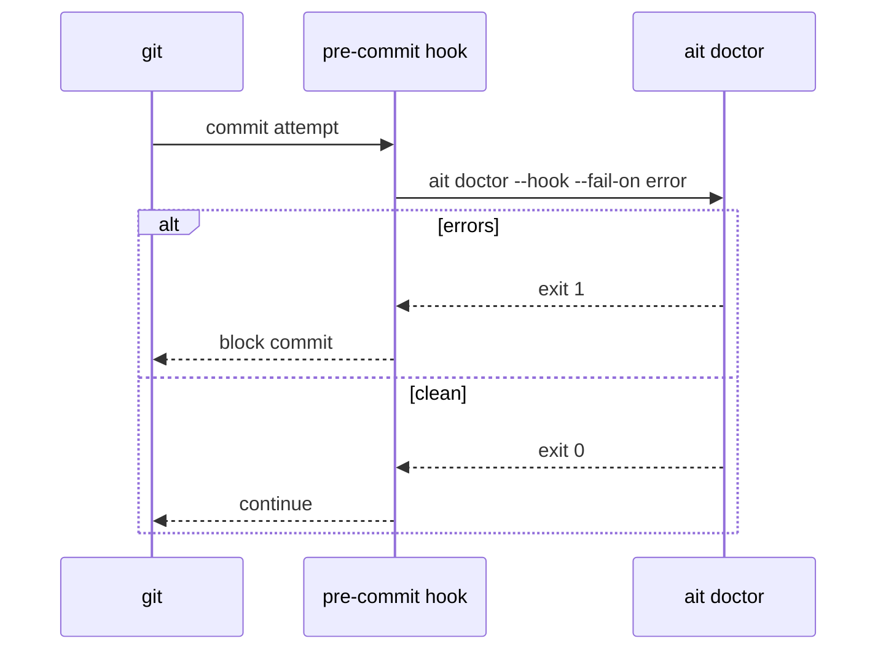

# ait — Systems design

| Field | Value |
|-------|--------|
| **PRD** | [docs/PRD.md](../PRD.md) v0.2 |
| **Design version** | 0.1 |
| **Last updated** | 2026-04-03 |
| **Status** | Draft |

## Revision history (design)

| Version | Date | Notes |
|---------|------|--------|
| 0.1 | 2026-04-03 | Initial design from PRD v0.2 |

---

## Design brief (Phase 3)

**Problem & scope:** Producers need Git defaults that match how **Ableton Live** lays out projects (`.als`, `Backup/`, samples, analysis sidecars) so repos stay **cloneable, legible, and safe for parallel humans**—without promising impossible merges of proprietary session files. **macOS only** for v1.

**Architecture (1–2 sentences):** A **single CLI** loads **versioned DAW profiles** (declarative ignore/LFS/doctor rules) and applies them to the **working tree** via file templates and optional **Git hooks**; all heavy lifting remains **Git + Git LFS** invoked as subprocesses. No hosted service.

**Top risks:** (1) False positives/negatives in `doctor` across Live versions. (2) Users expect multi-writer `.als` merge—mitigated by docs + lock semantics. (3) LFS/host quota surprises.

**Open:** Exact **distribution** formula (Homebrew vs npm wrapper); **default preset** for samples (ignored vs LFS).

**Stack recommendation:** **Static binary** ( **Go** preferred for fast iteration + simple cross-compile to universal macOS; **Rust** acceptable) distributed via **Homebrew**; avoid Node as the *only* runtime for v1 so `doctor` and hooks stay one artifact. *(PRD allows other stacks; this is the design **proposal**.)*

*User requested `/design-app` end-to-end; full sections below implement this brief.*

---

## Alignment

| PRD item | Engineering interpretation |
|----------|----------------------------|
| G1–G4 | Ship **profile-driven** `init` + `doctor` + docs + collaboration playbook; **Ableton profile v1** hardens before Logic profile stub. |
| FR-1–FR-3 P0 | **Template merge** for `.gitignore` / `.gitattributes`; **rule engine** for doctor; **bundled markdown docs** in repo and/or embedded in CLI `ait docs`. |
| FR-4–FR-8 | **Preset** = named bundle over same profile schema; hooks + lock file **schema**; Logic = **config-only profile**; `.als` introspection **post-MVP**. |
| NG1–NG5 | No merge engine, no `.als` round-trip, no SaaS, no plugin bundling, **no Windows/Linux** release targets for v1. |
| KPIs | Measure **doctor latency**, **init idempotency**, pilot **signal quality** (manual survey). |

---

## Context & constraints

- **Platform:** macOS 13+ (Ventura or later) **test matrix**; Apple Silicon + Intel. Paths assume POSIX; no UNC.
- **Regulatory / ToS:** Tooling reads user project files on disk only; **no** phoning home. Users owe **sample/pack licensing**; CLI may **warn** on redistributable-risk patterns (heuristic only—not legal advice).
- **Hosting:** None for product runtime. Users may use GitHub/GitLab/etc.; docs describe **LFS** implications generically.
- **Latency:** `doctor` target &lt; 30s @ &lt; 10k files—implies **bounded traversal**, avoid `git status` on huge ignored trees where possible (use `.gitignore` + direct fs walk with early exits).
- **Team / budget:** Greenfield; optimize for **maintainability** and **clear profile schema** over clever parsing.

**Codebase status:** **Greenfield** — no application code beyond README / `.gitignore`; nothing to reuse in-tree.

---

## Personas & journeys → system responsibilities

| Journey step | System responsibility |
|--------------|------------------------|
| Open Live project folder | **`ait init`**: detect or accept **project root**; select **DAW profile** + **preset**; write/merge templates. |
| First-time Git setup | Ensure `.git` exists or instruct; run `git lfs install` when LFS policy selected; never store credentials. |
| Validate repo health | **`ait doctor`**: run **rules** from profile + preset; subprocess checks for `git`, `git-lfs` presence/version. |
| Parallel collaboration | **Docs** (playbook) + optional **`.ait/lock.json`** + `doctor` **lock conflict** rule; no server enforcement. |
| CI / engineer path | **`ait doctor --json`** (stretch P0/P1): stable machine-readable **findings** + exit code contract. |
| Post-clone | Docs + **`ait doctor`** reminder to re-run **`ait hooks install`** if hooks not present. |

---

## Domain model

### Aggregates & entities

- **WorkspaceRoot:** Directory passed to CLI (default `.`). May or may not be a Git repo yet.
- **DawProfile:** Logical definition keyed by `id` (e.g. `ableton@12`). Contains: **markers** (how to detect a project), **ignore blocks**, **gitattributes lines**, **doctor rule set**, **documentation links**.
- **Preset:** Named overlay on a profile (`minimal`, `samples-ignored`, `samples-lfs`)—adjusts LFS globs and doctor **severity** thresholds.
- **InitPlan:** In-memory diff of files to write/merge + hooks to install + user prompts needed.
- **DoctorFinding:** `code`, `severity` (`error`|`warn`|`info`), `message`, optional `path`, `hint`, `doc_anchor`.
- **SessionLock (advisory):** JSON document at **`.ait/lock.json`** (see Data design). Not enforced by Git.
- **HookBundle:** Shell script or small shim committed under `.githooks/` or installed into `.git/hooks` (decision below).

### Invariants

- **I1:** `init` must be **idempotent**: re-run with same flags produces no destructive overwrite without `--force` or TTY confirm.
- **I2:** `doctor` must never modify the working tree **unless** a future subcommand explicitly allows fixits (out of MVP scope).
- **I3:** Profiles are **immutable at runtime** except via `ait` version upgrade; user overrides live in **`.ait/config.yaml`** (optional) layered over baked-in profile.

### Bounded contexts

- **CLI & commands** — user entrypoints.
- **Profiles** — declarative data (+ tests).
- **Rules engine** — doctor + init validation.
- **Git integration** — subprocess adapter only.

---

## Architecture

### Logical view



### Modules (proposed package layout)

| Module | Responsibility |
|--------|------------------|
| `cmd/ait` | CLI parsing, global flags (`--verbose`, `--json`), version. |
| `internal/profile` | Load embedded YAML/JSON profiles; merge presets; version compatibility. |
| `internal/init` | Compute file diffs; merge `.gitignore` / `.gitattributes`; `git init` orchestration. |
| `internal/doctor` | Schedule rules; aggregate findings; exit codes. |
| `internal/rules/*` | One package per rule family: `git`, `lfs`, `ableton_layout`, `lockfile`, `size`. |
| `internal/git` | Subprocess wrapper: `git version`, `git lfs version`, `git check-ignore`, rev-parse, ls-files. |
| `internal/hooks` | Write hook scripts; content-stable templates. |
| `internal/config` | Read `.ait/config.yaml` user overrides (optional v1). |

### Sync vs async

All operations are **synchronous CLI**; no background workers, no queues.

---

## Data design

### Files created or managed by ait

| Path | Purpose | Retention |
|------|---------|-----------|
| `.gitignore` | Merge-generated ignores | Versioned |
| `.gitattributes` | LFS track patterns, optional diff drivers (future) | Versioned |
| `.ait/config.yaml` | User overrides: `profile`, `preset`, ignored rules | Versioned (optional) |
| **`.ait/lock.json`** | Advisory lock (**Decision** for PRD TBD) | Versioned **optional**—teams may gitignore if they prefer local-only; default doc recommends **commit** for visibility |
| `.githooks/pre-commit` or `.git/hooks/pre-commit` | Invokes `ait doctor --hook` | Install path **Decision:** prefer **`.git/hooks`** with `core.hooksPath` **unset** for MVP simplicity—installer writes hook directly; document `hooksPath` alternative in v2 |

### `.ait/lock.json` schema (v1)

```json
{
  "version": 1,
  "holder": "github-handle-or-name",
  "scope": { "paths": ["Show.als", "Projects/EP1/"] },
  "issued_at": "2026-04-03T12:00:00Z",
  "expires_at": "2026-04-04T12:00:00Z",
  "note": "optional free text"
}
```

**Rules:** `doctor` warns if two committed locks overlap active TTL; **stale** = `expires_at` &lt; now → info-level reminder to remove. **No crypto**—honor system.

### Embedded profile storage

Ship profiles as **`embed.FS`** (Go) or equivalent: `profiles/ableton@12.yaml`, `presets/*.yaml`. **Hash** profile version into `ait version -v` output for supportability.

### PII

No user PII collected by the tool. Lock file may contain **display names** only—document that it is **not** secret.

---

## APIs & integrations

### CLI surface (contract)

| Command | Args | Behavior |
|---------|------|----------|
| `ait init` | `--daw ableton`, `--preset minimal|samples-ignored|samples-lfs`, `--dry-run`, `--force` | Merge templates; optional `git init`; `git lfs install` if needed. |
| `ait doctor` | `--json`, `--fail-on warn|error`, `--hook` (quiet mode for hooks) | Emit findings; exit `1` if errors (and optionally warnings). |
| `ait hooks install` | `--uninstall` | Install/remove hook scripts. |
| `ait version` | | Binary + embedded profile versions. |

**Idempotency:** `init` and `hooks install` safe to re-run.

### External integrations (subprocess only)

| Integration | Use |
|-------------|-----|
| `git` | Repo detection, `ls-files`, `check-ignore`, config. |
| `git-lfs` | Version check; `install`; validate pointers vs `.gitattributes` expectations. |

No REST APIs, no OAuth.

---

## Key workflows

### W1 — `ait init` (happy path)



### W2 — `ait doctor`



### W3 — Git hook (pre-commit)



**Irreversible operations:** `git` operations initiated by user outside `ait` are out of scope; `ait` does not auto-`git push`.

---

## UX / information architecture

**Surface:** Terminal only (v1). **Principles:**

- **Progressive disclosure:** default output short; `--verbose` for rule names and timings.
- **Actionable errors:** every **error** includes **fix** hint (e.g. “Remove `Backup/` from index: `git rm -r --cached Backup`”).
- **Empty states:** `doctor` in clean repo prints **one** positive line.
- **Docs command:** `ait docs collaboration` opens bundled path or prints path to `docs/` in repo (implementation choice).

**Critical “screens” (outputs):** `init` summary table; `doctor` grouped by severity; `hooks install` confirmation.

---

## Security & abuse

| Threat | Mitigation |
|--------|------------|
| Malicious project path | `doctor`/`init` resolve **realpath**; refuse `..` escape from intended root where feasible. |
| Hook tampering | Hooks are **written by ait**; user reviews diff; docs warn against third-party hook chains. |
| Secret leakage in repo | Optional future rule: detect high-entropy strings (post-MVP); v1 **not** required. |
| Supply chain (install) | Prefer **signed** Homebrew bottles or checksums in install docs. |

**AuthZ model:** N/A (local CLI).

---

## Reliability & ops

- **SLO:** Same as PRD latency target; add **timeout** per rule (e.g. 5s) to avoid hung `git` calls.
- **Retries:** None for local subprocess—fail fast with error finding.
- **Partial failure:** `doctor` runs all rules even if one errors; aggregates **rule errors** separately from **findings**.

---

## Observability

| Signal | Use |
|--------|-----|
| Exit code `0/1/2` | `0` ok; `1` errors; `2` optional warnings-as-fail |
| `--json` findings | CI ingestion (`code`, `severity`, `path`) |
| `--verbose` timing | Debug slow rules |

No remote telemetry in v1 (**Decision**).

---

## Testing strategy (design-level)

| Layer | What to test |
|-------|----------------|
| **Unit** | Profile merge logic; ignore merge; lock JSON validation; each doctor rule with **fixture trees** (tmp dirs). |
| **Integration** | Subprocess against **real `git`** in temp repo; LFS optional in CI matrix. |
| **Golden** | Snapshot `.gitignore` output for `init` per preset. |
| **Manual** | Run against real Ableton **tutorial projects** + dogfood repos. |

**Environments:** macOS CI (GitHub Actions **macos-14** or similar); local dev.

---

## Rollout & migrations

1. **v0.1.0:** `init` + `doctor` + Ableton profile + docs; no hooks optional flag default **off** until stable.
2. **v0.2.0:** Default **on** for `hooks install` recommendation; add `--json` stable schema **version** field.
3. **Profile bumps:** `ableton@12` → `ableton@13` additive; migration doc for changed ignore lines.

**Feature flags:** CLI flags only; no remote flags.

---

## Open questions & decisions

| PRD / design topic | Resolution |
|--------------------|------------|
| Primary distribution | **Proposal:** Homebrew formula + GitHub **releases** attach `ait-darwin-amd64` + `arm64` binaries (universal or split). |
| Default sample preset | **Proposal:** Default **`samples-ignored`** for smallest surprise; document **`samples-lfs`** one command away. |
| Lock file path | **Decision:** **`.ait/lock.json`** (single file v1); multiple locks = future array schema. |
| `templates` subcommand | **Decision:** **Fold into `init`** for MVP; `ait templates list` **v1.1** if needed. |
| Monorepo vs per-song | **Proposal:** Docs describe **both**; `doctor` supports **multi-`.als`** monorepo with per-path ownership in playbook—not automated. |
| Implementation language | **Proposal:** **Go** + `cobra`; **Alt:** Rust + `clap`. |

**Needs legal / vendor input:** Whether embedding Ableton **trademark** in command names requires style guide (use “Ableton Live” in docs; CLI flag `ableton` likely fine as factual reference).

---

## References

- PRD: [docs/PRD.md](../PRD.md)
- [Git LFS](https://git-lfs.com/)
- [gitattributes](https://git-scm.com/docs/gitattributes)
- Ableton Help: [file types](https://help.ableton.com/hc/en-us/articles/209769625-Live-specific-file-types), [Collect All](https://help.ableton.com/hc/en-us/articles/209775645-Collect-All-and-Save), [Backups](https://help.ableton.com/hc/en-us/articles/360000377870-Backup-Sets), [Managing files](https://www.ableton.com/en/manual/managing-files-and-sets/)
- Prior art: [ableton-git](https://github.com/clintburgos/ableton-git), [ablegit](https://github.com/thorhop/ablegit), [alsdiff](https://github.com/krfantasy/alsdiff)
